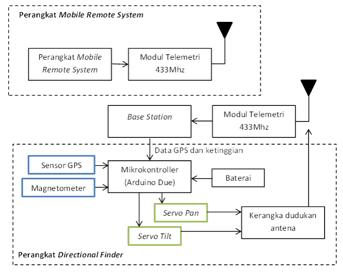
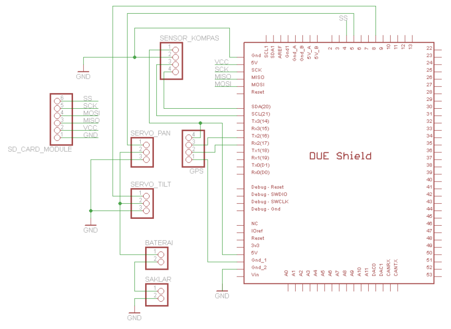
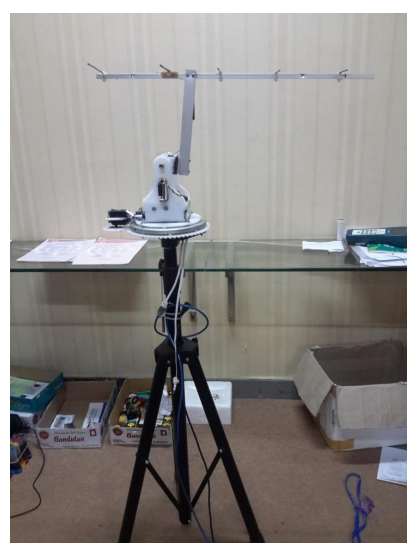
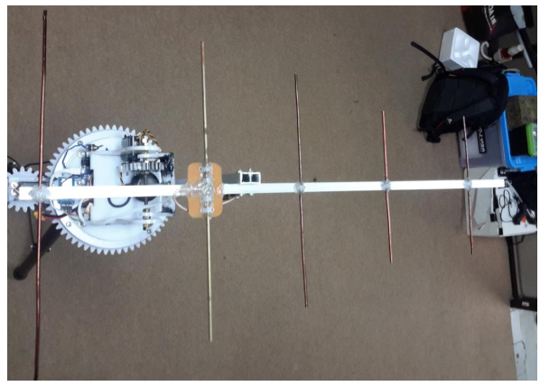
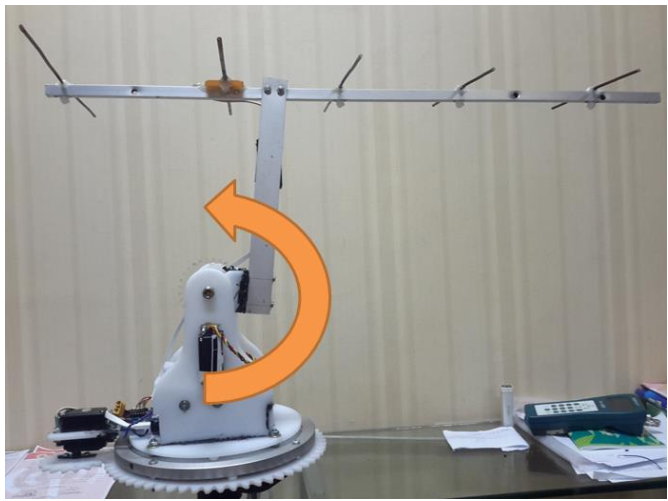
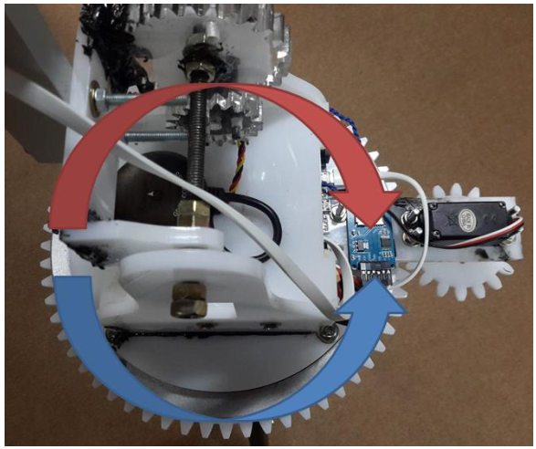
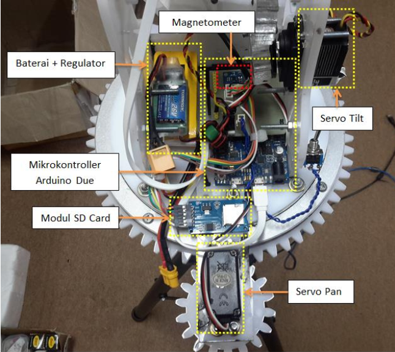
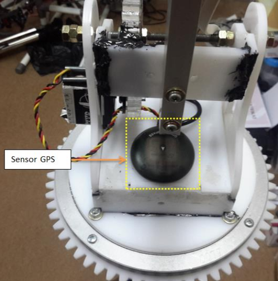
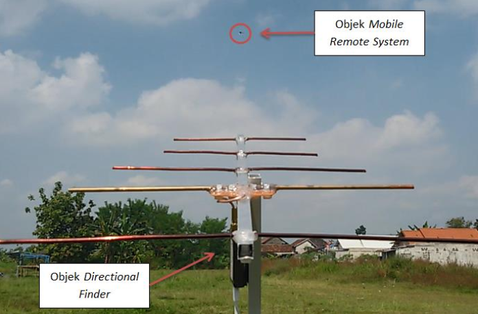

# Antenna-Tracker-UAV
## Design System of Directional Finder Based nn Coordinates Mobile Remote System Using Moving Object Prediction Algorithm

This project is bachelor thesis project, when i took bachelor study in Engineering Physics at Universitas Gadjah Mada, Indonesia

## block diagram system

## prototype implementation

## testing process

